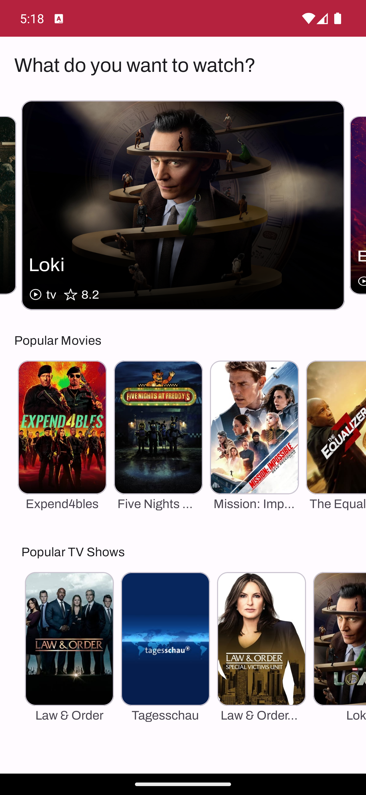
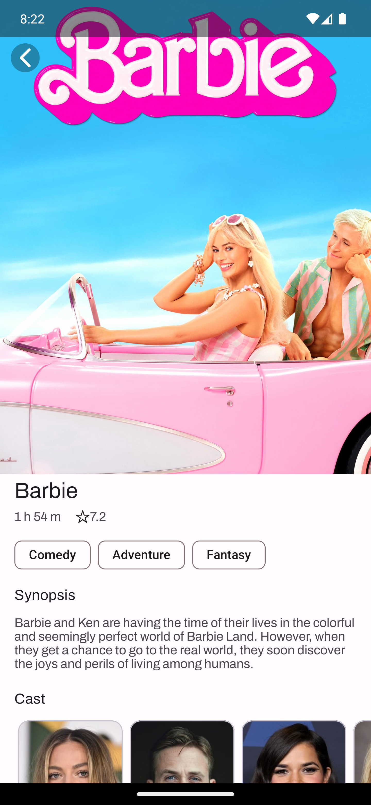

# Popcorn

This is a mobile application that utilizes the TMDB (The Movie Database) API to display the latest trends in movies and TV series. With a user-friendly and intuitive interface, this app allows users to keep track of the most popular productions of the moment and obtain detailed information about them.


## Screenshots

    


## Features

- Show trending movies and TV shows
- Duration, cast, synopsis, duration and audience rating
- Light and dark theme
- Themed app icon (Android 13+)
- Languages: English and Portuguese


## Running the project

1. Clone the project by copying this command to your terminal:

```bash
  git clone https://github.com/vitorfg8/Popcorn
```

2. Open the project in Android Studio

3. Create a new account and generate an API key in [TMDB](https://developers.themoviedb.org/3/getting-started/introduction)

4. Add the TMDB API key to the "local.properties" file:

```groovy
API_KEY=0123456789abcd
```

5. Run the app


## Tech Stack

**Architecture** MVVM, Clean Archteture

**Network:** Retrofit, GSon, Corroutines

**Dependency injection** Koin


## License

This project is licensed under the [MIT](https://choosealicense.com/licenses/mit/) License - see the [LICENSE](LICENSE) file for details.

UI inspired by [Material Design 3](https://m3.material.io/) and [Eclipse](https://dribbble.com/shots/21234862-Eclipse-Movie-Stream-Mobile-App) by [Ihya Fathurr](https://dribbble.com/ihyaet)

This application uses TMDB and the TMDB APIs but is not endorsed, certified, or otherwise approved by TMDB.